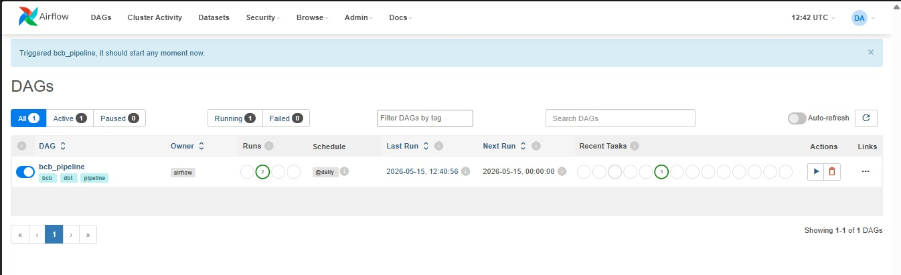
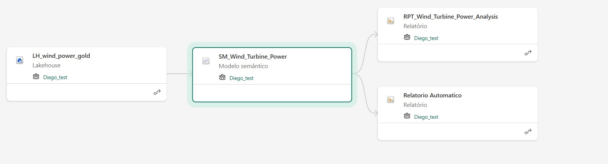
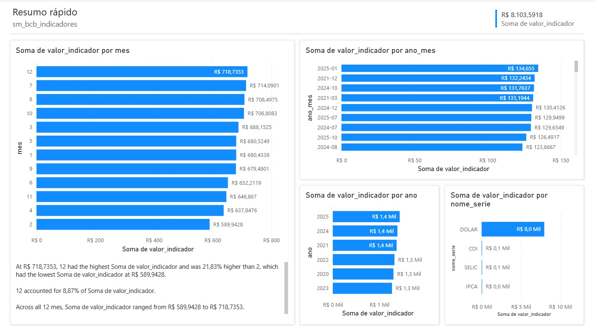

# Pipeline BCB — Indicadores Econômicos

Pipeline de dados completo que consome indicadores econômicos da API do Banco Central do Brasil (BCB), processa nas camadas bronze/silver/gold e entrega visualizações no Power BI via Microsoft Fabric.

---

## Arquitetura

```
API BCB (SGS)
     │
     ▼
[Python + SQLAlchemy]
     │  Ingestão com idempotência
     ▼
SQL Server — bronze_bcb_series
     │
     ▼
[dbt]
     │  silver: stg_bcb_series (view com tipagem e limpeza)
     │  gold:   fct_indicadores_bcb (tabela analítica)
     ▼
[Apache Airflow — Docker]
     │  Orquestração diária: ingest → dbt run → dbt test
     ▼
[Microsoft Fabric — Copy Job + Notebook]
     │  SQL Server → Lakehouse (Delta tables)
     ▼
[Semantic Model — Direct Lake]
     │
     ▼
Power BI
```

---

## Tecnologias

| Camada | Tecnologia |
|---|---|
| Ingestão | Python, Requests, Pandas, SQLAlchemy |
| Armazenamento | SQL Server 2022 |
| Transformação | dbt Core + dbt-sqlserver |
| Orquestração | Apache Airflow 2.9 (Docker) |
| Lakehouse | Microsoft Fabric (OneLake) |
| Visualização | Power BI (Direct Lake) |
| Containerização | Docker + Docker Compose |

---

## Indicadores coletados

| Indicador | Código SGS | Frequência |
|---|---|---|
| Taxa Selic | 11 | Diária |
| IPCA | 433 | Mensal |
| Dólar (PTAX) | 1 | Diária |
| CDI | 12 | Diária |

Período: 01/01/2020 a 31/12/2025 — **4.593 registros por indicador**

---

## Estrutura do projeto

```
pipeline-bcb/
├── ingestion/
│   └── extract_bcb.py          # ETL: API → SQL Server (bronze)
├── database/
│   └── create_tables.sql       # DDL da camada bronze
├── transformation/
│   └── dbt_bcb/
│       └── models/
│           ├── sources.yml     # fonte: bronze_bcb_series
│           ├── silver/
│           │   ├── stg_bcb_series.sql   # view com limpeza e tipagem
│           │   └── schema.yml           # testes de qualidade
│           └── gold/
│               └── fct_indicadores_bcb.sql  # tabela analítica final
└── orchestration/
    ├── Dockerfile              # Airflow + ODBC Driver 17 + dbt
    ├── docker-compose.yml      # webserver, scheduler, postgres
    ├── requirements.txt
    └── dags/
        └── bcb_pipeline_dag.py # DAG: ingest → dbt run → dbt test
```

---

## Camadas de dados

### Bronze — `dbo.bronze_bcb_series`
Dados brutos da API do BCB. Ingestão idempotente via `INSERT WHERE NOT EXISTS` — reexecuções não duplicam registros.

### Silver — `dbt_dev.stg_bcb_series`
Camada de padronização:
- Tipagem explícita (`CAST`)
- Normalização de strings (`UPPER(TRIM())`)
- Filtro de valores nulos
- 6 testes de qualidade (not_null, accepted_values)

### Gold — `dbt_dev.fct_indicadores_bcb`
Tabela analítica com campos derivados:
- `ano`, `mes`, `ano_mes` para análise temporal
- Filtro final de valores nulos
- Materializada como `table`

---

## Como executar

### Pré-requisitos
- Docker Desktop
- SQL Server local (porta 1433)
- ODBC Driver 17 for SQL Server
- Python 3.10+

### 1. Configurar variáveis de ambiente
Crie um arquivo `.env` na raiz:
```
DB_SERVER=127.0.0.1
DB_PORT=1433
DB_DATABASE=pipeline_bcb
DB_USERNAME=sa
DB_PASSWORD=sua_senha
DB_DRIVER=ODBC Driver 17 for SQL Server
```

> **Segurança:** o arquivo `.env` está no `.gitignore` e não é versionado. As credenciais nos arquivos `profiles.yml` e `docker-compose.yml` são de ambiente local de desenvolvimento. Em produção, utilize um secrets manager (Azure Key Vault, AWS Secrets Manager ou variáveis de ambiente do Airflow).

### 2. Criar tabela bronze no SQL Server
```sql
-- database/create_tables.sql
```

### 3. Subir o Airflow
```bash
cd orchestration
docker compose up --build
```
Acesse: http://localhost:8080 (admin/admin)

### 4. Executar a DAG
Ative e execute a DAG `bcb_pipeline` no Airflow UI.

---

## Airflow — DAG bcb_pipeline

```
ingest_bcb → dbt_run → dbt_test
```

- `ingest_bcb`: chama `main()` do script Python — consome a API e carrega a bronze
- `dbt_run`: executa `dbt run` dentro do container — transforma silver e gold
- `dbt_test`: executa `dbt test` — valida qualidade dos dados

---

## Microsoft Fabric

Os dados são sincronizados do SQL Server para o Microsoft Fabric Lakehouse via:

1. **Copy Job** — copia as 3 tabelas (bronze/silver/gold) do SQL Server para `LH_BCB` usando On-premises Data Gateway
2. **Notebook PySpark** — reescreve como Delta tables nativas para suporte ao Direct Lake
3. **Semantic Model** — modelo semântico sobre a camada gold
4. **Power BI** — relatório com conexão Direct Lake (sem scheduled refresh)

---

## Screenshots

### Airflow — DAG executada com sucesso


### Microsoft Fabric — Lakehouse LH_BCB


### Power BI — Indicadores BCB (2020–2025)


---

## Autor

**Diego Padavini**
[LinkedIn](https://www.linkedin.com/in/diego-padavini-a62489b4/) · [GitHub](https://github.com/Padavini)
